# Laboratorio GitHub Actions
## 1. Workflow CI para el proyecto de frontend
El workflow de este apartado está en el fichero ci-front.yaml. En él se puede ver que los eventos que disparan el workflow son el push y el pull_request definidos en on. Los pasos de los que está compuesto son los indicados en los jobs build y test. Las acciones de GitHub Action usadas son actions/checkout y actions/setup-node.

### Eventos que disparan el workflow.
*Nombre del workflow y definición de on en ci-front.yaml*
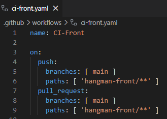

1. Evento *push* se dispara cuando:
    - Se hace un push sobre la rama main
    - Y los cambios afectan a archivos dentro de hangman-front/

2. Evento *pull_request* se dispara cuando:
    - Se crea o actualiza una Pull Request hacia main
    - Y la PR modifica archivos dentro de hangman-front/

### Pasos que componen el workflow.
*Pasos del job build*
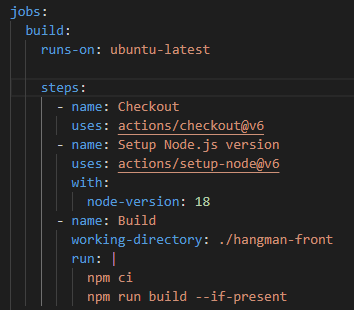

El job build se ejecuta sobre una máquina Ubuntu y sus pasos son:
    
    1. Descarga del repositorio.
    2. Instalación de la versión 18 de Node.js.
    3. Instala dependencias y compila la aplicación.

*Pasos del job test*
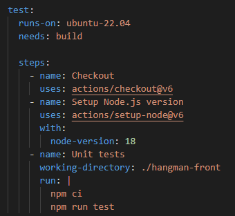

El job test se ejecutará únicamente si el trabajo anterior (build) finaliza correctamente. Si es así, también va sobre una máquina Ubuntu y sus pasos serían los siguientes:
    
    1. Descarga del repositorio.
    2. Instalación de la versión 18 de Node.js
    3. Lanza los test unitarios tras instalar las dependencias.

### Acciones que utiliza el workflow.
Las acciones de GitHub Actions que utiliza el workflow son:
- actions/checkout .- su función es clonar el repositorio.
- actions/setup-node .- su función es instalar y configurar Node.js.

### Comentario adicional 
En la primera ejecución del workflow se ha producido un fallo en uno de los tests tal y como se muestra en la siguiente imagen.

*Fallo en la ejecución del workflow*
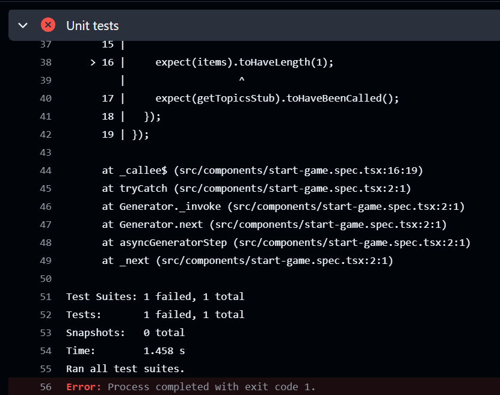

Para arreglar el error he tenido que modificar el tamaño esperado del array de 1 a 2.
Tras arreglar ese error se lanza de forma automática el workflow que finaliza con éxito.

*Ejecución exitosa del workflow*
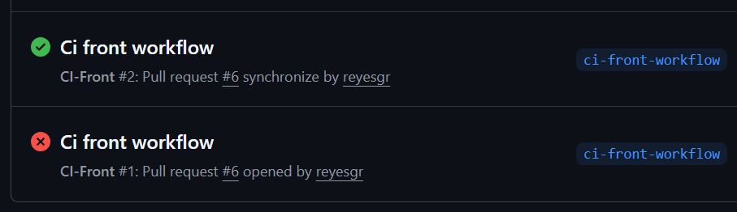

## 2. Workflow CD para el proyecto de frontend
El workflow de este apartado está en el fichero cd-front.yaml. Tal y como podemos ver definido en on,  no hay ningún evento que dispare el workflow, sino que se dispara manualmente. En este caso tenemos un único job que es el que define los pasos a seguir. Las acciones de GitHub Action usadas son actions/checkout, docker/login-action, docker/setup-buildx-action y docker/build-push-action.

### Eventos que disparan el workflow.
*Nombre del workflow y definición de on en cd-front.yaml*
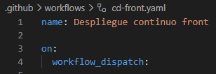

En este caso el evento *workflow_dispatch* permite lanzar el workflow manualmente, elegir cuando desplegar evitando despliegues automáticos en cada push.

Para ejecutarlo habrá que seguir los siguientes pasos:
1. Ir a la pestaña Actions del repositorio
2. Seleccionar el workflow
3. Pulsar Run workflow

### Pasos que componen el workflow.
*Pasos del job buildAndPushImage*
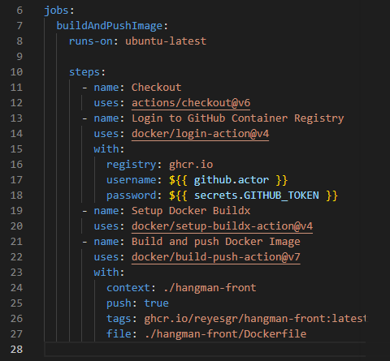

En este caso el workflow solo tiene un job, *buildAndPushImage*, que se ejecuta sobre una máquina Ubuntu. Éste construirá una imagen Docker y la publicará en GitHub Container Registry. Sus pasos son:
1. *Descarga del repositorio*.
2. *Login en GitHub Container Registry*.- Autentifica contra ghcr.io para poder subir imágenes Docker utilizanndo como usuario al que ejecuta el workflow y como contraseña un token automático proporcionado por el propio GitHub.
3. *Configuración del Docker Buildx*.- Activa Docker Buildx que permite builds avanzadas, multiplataforma, caché de capas y mejor rendimiento.
4. *Construcción y publicación de la imagen*. 
    
### Acciones que utiliza el workflow.
Las acciones de GitHub Actions que utiliza el workflow son:
- actions/checkout .- su función es clonar el repositorio.
- docker/login-action .- su función es realizar el logien en el registry de Docker.
- docker/setup-buildx-action .- su función es configurar Docker Buildx.
- docker/build-push-action .- su función es construir y publicar imágenes Docker.

### Comentario adicional 
En esta ocasión me he encontrado con tres problemas a la hora de ejecutar el workflow.

*Fallos en la ejecución del workflow*
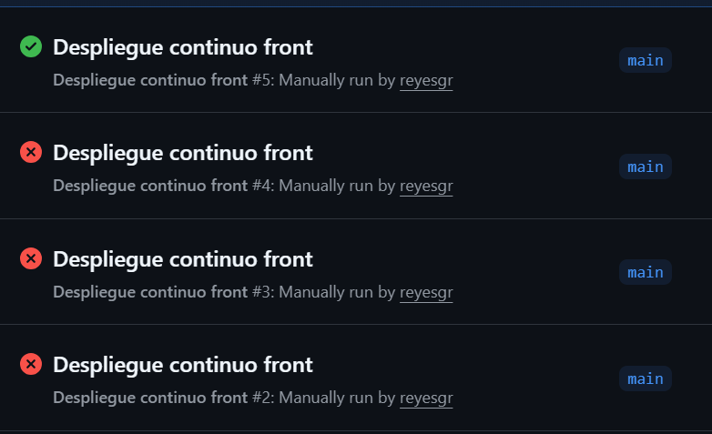
    
El **primer error** se produjo porque estába intentando publicar la imagen creada en Docker Hub (ya que en tag había dejado reyesgrinformatica/hangman-front:latest), mientras que las credenciales utilizadas para el login son para el container registry de GitHub.

*Primer error de workflow*
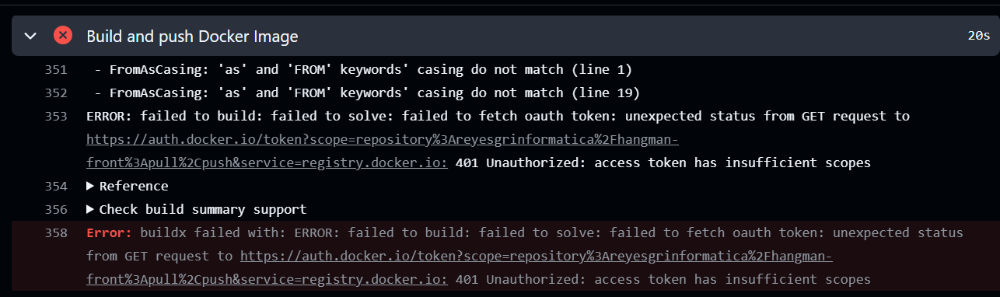

El **segundo error** se produjo porque había dejado el nombre del usuario de Docker Hub en el tag para subir la imagen al container registry de GitHub (en el tag ghcr.io/reyesgrinformatica/hangman-front:latest). El usuario, en este caso, es reyesgr y no reyesgrinformatica.

*Segundo error de workflow*
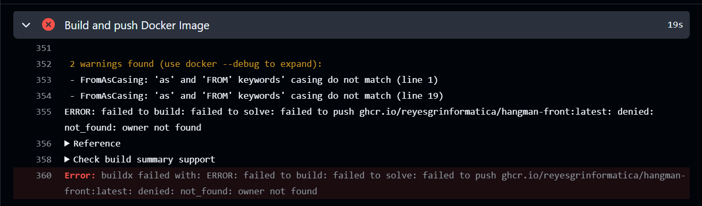

El **tercer error** se produjo por una cuestión de permisos, la instalación no tiene permitida la creación de paquetes.

*Tercer error de workflow*
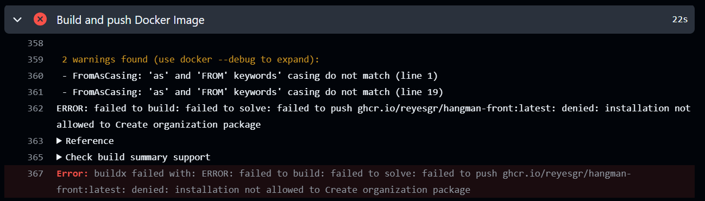

Se resuelve modificando los *Settings* del repositorio de GitHub e indicándole que se le permite a los workflows su lectura y escritura. Para ello hay que ir a los Settings y, dentro de estos, a las acciones generales (Settings-->Actions-->General).

*Modificación de los Settings del rpositorio*
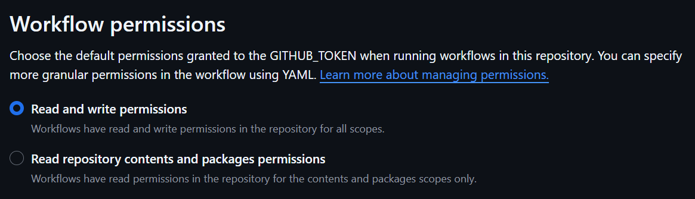

En los paquetes de mi repositorio aparecerá la imagen publicada.

*Imagen publicada*
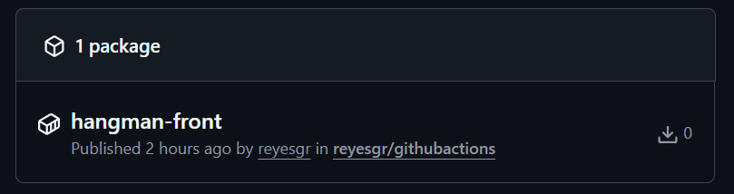

